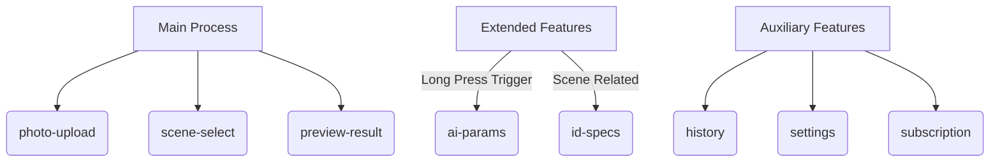
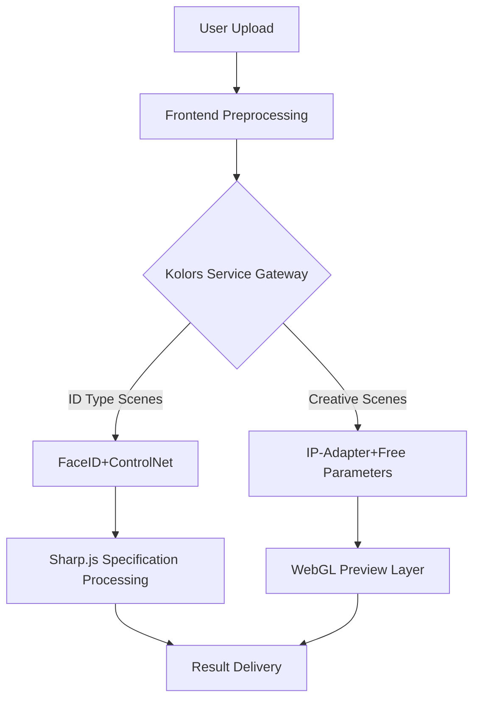

# Portraify - AI Portrait Generator

Portraify is an AI-powered portrait generator that creates professional-looking portraits for various scenarios, including professional headshots, passport photos, and social media profiles.

## Main Features

1. Professional Portrait Generation
2. ID Photos (Passport/Visa)
3. Business Meeting Portraits
4. Academic Conference Speaker Photos
5. Social Media Profile Picture Optimization
6. Wedding Invitation Portraits
7. Student/Employee ID Photos
8. Virtual Meeting Background Portraits

### Scene Generation Features (8 Core Interfaces)
| Interface File     | Feature Description                          | Interaction Optimization Strategy |
|-------------------|---------------------------------------------|----------------------------------|
| photo-upload.tsx  | Smart Photo Upload with Face Detection       | Drag & Drop + Click Dual Mode    |
| scene-select.tsx  | 8 Scene Tile Selection Interface            | Long Press for Quick Parameter Adjustment |
| ai-params.tsx     | AI Parameter Panel (Background/Lighting/Detail) | Real-time WebGL Preview Canvas |
| preview-result.tsx| Generation Effect Comparison and Download    | Comparison Slider + Multi-size Export |
| id-specs.tsx      | Global ID Photo Specifications Database      | Scene-related Dynamic Display    |
| subscription.tsx  | Subscription Plans and Member Privileges     | On-demand Dynamic Loading        |
| history.tsx       | Generation History Timeline                  | Waterfall Flow + Smart Tags      |
| settings.tsx      | Multi-language Switch and Quality Settings   | Scene Mode Switch Controls       |


### Layered Navigation Architecture


## Technical Implementation Requirements
### Frontend Architecture
- React 18 + TypeScript
- Router Management: react-router-dom v6
- State Management: Zustand
- Internationalization: react-i18next
- UI Library: HeadlessUI + @heroicons/react
- Styling Solution: Tailwind CSS 3.3+ (configured with viewport adaptation)
- Rapid Validation Integration: Replicate API

## Getting Started

### Prerequisites

- Node.js 16.x or higher
- npm or yarn

### Installation

1. Clone the repository:
```bash
git clone https://github.com/yourusername/portraify.git
cd portraify
```

2. Install dependencies:
```bash
npm install
# or
yarn install
```

3. Start the development server:
```bash
npm run dev
# or
yarn dev
```

4. Open [http://localhost:3000](http://localhost:3000) in your browser to see the application.

## Project Structure

```
portraify/
├── public/
│   └── scenes/       # Scene images
├── src/
│   ├── components/   # Reusable components
│   ├── hooks/        # Custom hooks
│   ├── pages/        # Page components
│   ├── store/        # Zustand store
│   └── styles/       # Global styles
├── .gitignore
├── next.config.js
├── package.json
├── postcss.config.js
├── README.md
├── tailwind.config.js
└── tsconfig.json
```

## Features

- **Photo Upload**: Upload your photo with drag-and-drop or file selection
- **Scene Selection**: Choose from 8 different portrait scenarios
- **AI Parameters**: Adjust background, lighting, and detail parameters
- **Preview Results**: Compare original and generated portraits with a slider
- **ID Specifications**: Access global ID photo requirements
- **Subscription Plans**: Choose from Free, Pro, and Unlimited plans
- **History**: View and manage your generated portraits
- **Settings**: Customize language, quality, theme, and other preferences

# Portraify × Kolors Integration Solution (Requirement Document Appendix)

## Technical Architecture Design


## Integration Model List
The following is a list of models that need to be integrated, separated by commas, representing: scenario type, recommended model, deployment method, performance indicator

## AI integration
SiliconFlow's Kolors Model

## SiliconFlow Kolors Integration
Portraify now integrates SiliconFlow’s Kolors AI model to provide higher-quality portrait generation capabilities.

### Configure SiliconFlow API

1. Register a SiliconFlow account and get API key:
   - Visit [SiliconFlow website](https://siliconflow.com) to register an account
   - Create API key in the console

2. Configure environment variable:
   - Copy `.env.example` file and rename it to `.env.local`
   - Fill your API key into `NEXT_PUBLIC_KOLORS_API_KEY` variable

```bash
# .env.local example
NEXT_PUBLIC_KOLORS_API_KEY=your_kolors_api_key_here
```

### Use Kolors to Generate Portrait

1. Enable "SiliconFlow Kolors AI" option in AI parameter page
2. Choose a style suitable for your scene:
   - Natural style: Portrait with natural appearance
   - Professional style: Suitable for business and professional occasions
   - Art style: Enhance color and artistic effect
   - Dramatic style: Strong light and shadow contrast
3. Adjust background, lighting, and detail parameters
4. Click "Generate with Kolors AI" button to generate portrait

### Kolors API Features

- High-quality portrait generation
- Multiple style options
- More natural light and shadow effect
- More detailed detail processing
- Better background blending

## License

This project is licensed under the MIT License - see the LICENSE file for details.